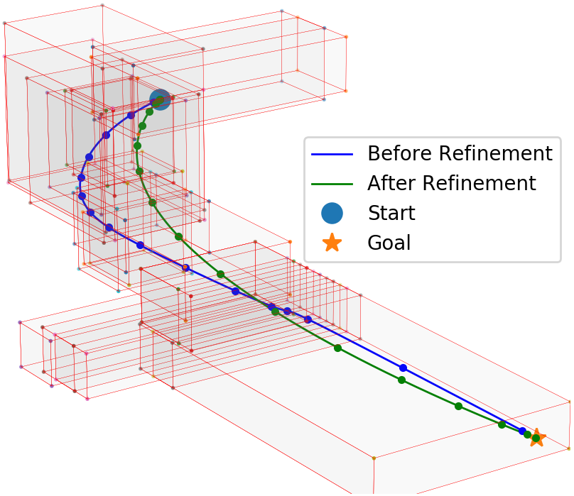

# Bilevel Planner
by researchers from [Intelligent Motion Lab](http://motion.pratt.duke.edu/) at Duke University

## Overview
This package is a stand-alone implementation of our UAV trajectory generator. It is able to generate optimal (minimizing jerk/snap and traversal time) trajectories in real-time.

<!--img src="images/pointcloud.png" alt="Flying through a gazebo" width="500"/>


## Usage

### System Requirements
This package only relies on valid a C++ complier and a Python interpretor. We have tested it on macOS High Sierra and Ubuntu 16.04.

### License for Mosek
This implementation relies on Mosek, a commercial QP solver that provides free license for educational purpose. One can obtain a free personal academic license from [here](https://www.mosek.com/products/academic-licenses/), and place it inside a folder name "mosek" in the home directory. 

### Dependencies
C++: Please make sure that the following C++ packages are installed, which means that they can be found through CMake's find_package command.  
* [Pybind11](https://github.com/pybind/pybind11). A package that allows people to call C++ code from Python.
* [Boost](https://www.boost.org/). There is no required minimum version, but the lowest version we have tested upon is 1.58.
* [Eigen3](http://eigen.tuxfamily.org/index.php?title=Main_Page). A C++ linear algebra library.

Python: Please make sure that the following Python packages are installed.
* [Mosek](https://docs.mosek.com/9.0/pythonapi/install-interface.html). We uses the MOSEK Optimizer API for Python.
* [NumPy](https://www.numpy.org/), [SciPy](https://www.scipy.org/), [matplotlib](https://matplotlib.org/), [tabulate](https://bitbucket.org/astanin/python-tabulate/src/master/).
You may be able to install the above Python packages by:
```bash
# Install Mosek
pip install -f https://download.mosek.com/stable/wheel/index.html Mosek --user # skip --user for a system-wide installation
# Install other packages
pip install numpy, scipy, matplotlib, tabulate --user # skip --user for a system-wide installation
```

### Step by step walkthrough

* Please make sure that all the C++ and Python dependencies are installed.
* Please make sure that a license for Mosek is installed.
* Download this repo
```bash
git clone https://github.com/OxDuke/Bilevel-Planner.git
```
* Complie C++ code
```bash
cd Bilevel-Planner
mkdir build
cd build
cmake ..
make
```
* Run an example
```bash
cd ..
python spatialSolver.py 58
```
* Run more examples: There are 100 examples included in the "dataset/" directory. If you want to run the i-th (i = 1, ..., 100) example, run:
```bash
python spatialSolver.py i
```

### What you shoud see


## Theory
The theory of this planner is described in the paper:
[Fast  UAV  Trajectory  Optimization  using  BilevelOptimization  with  Analytical  Gradients](https://arxiv.org/pdf/1811.10753.pdf)

## Contact
If you any problems with this package or the paper, feel free to report an issue or contact us.
<!--Weidong Sun, Gao Tang, Kris Hauser-->
